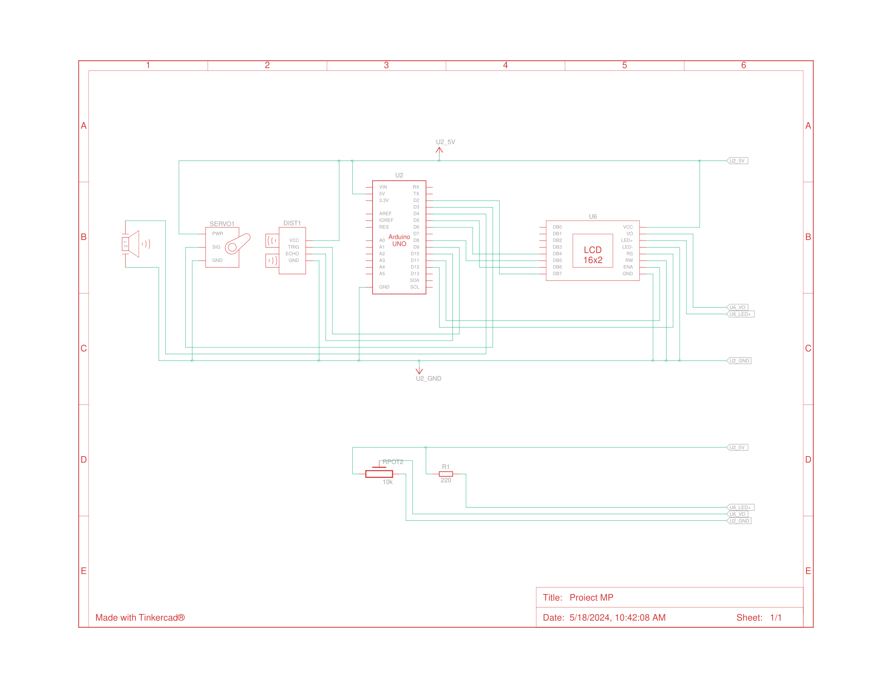

# Multi-directional Proximity Detection System with Sensor(s)

| | |
|-|-|
|`Author` | Popescu Adrian

## Description
The Multi-directional Proximity Detection System with Sensor(s) is a project designed to detect potential threats in the surrounding environment and alert the user through a visual display. The system uses one or multiple proximity sensors to scan the area and a microcontroller to process the data and display the information on a display device, such as an LCD screen or other suitable display. The display shows a radar in polar coordinates with the detected threats, providing the user with an intuitive way to visualize the location of potential threats. The system can be used in various applications, such as home security, robotics, and drone navigation. By using a rotating sensor or multiple sensors, the system can cover a wider area and provide more accurate information about the location of potential threats. The system can also be programmed to track the closest threat, providing the user with real-time information about the most imminent danger. The flexible design of the system allows for different display options and additional features to be added as needed.

## Motivation
Anduril Industries, a cutting-edge defense technology company, has been a significant source of inspiration for the development of the Multi-directional Proximity Detection System with Sensor(s). Anduril's mission to transform the defense industry with advanced artificial intelligence and autonomous systems has showcased the immense potential of technology in safeguarding human lives and national security.

In line with Anduril's innovative approach, the Multi-directional Proximity Detection System with Sensor(s) aims to provide a reliable and cost-effective solution for detecting potential threats in the surrounding environment. By leveraging the power of microcontrollers, proximity sensors, and display devices, the system can offer real-time information about the location of potential threats, enabling users to take timely and appropriate action. The system's flexibility in terms of the number of sensors and display options makes it suitable for a wide range of applications, from home security to robotics and drone navigation. With the Multi-directional Proximity Detection System with Sensor(s), we aspire to contribute to the advancement of defense technology and enhance the safety and security of people and assets.

## Architecture
The Multi-directional Proximity Detection System with Sensor(s) comprises several components that work together to detect potential threats and provide real-time information to the user. The system's architecture can be divided into three main parts: sensing, processing, and display.

The sensing component consists of one or multiple proximity sensors, which are responsible for detecting the presence of objects or people in the surrounding environment. The sensors can be mounted on a rotating platform or positioned at fixed locations to cover a wider area. The sensors used in the system can be of different types, such as infrared, ultrasonic, or radar, depending on the application's requirements.

The processing component comprises a microcontroller that receives data from the sensors and processes it to extract relevant information about the location and distance of potential threats. The microcontroller can be programmed to filter out noise and false alarms and to track the closest threat. The microcontroller used in the system can be an Arduino, ESP32, or any other suitable microcontroller board.

The display component consists of a display device, such as an LCD screen, OLED display, or LED matrix, that shows the radar in polar coordinates with the detected threats. The display device can be interfaced with the microcontroller using standard communication protocols such as I2C, SPI, or UART. The display can be customized to show additional information, such as the distance and direction of the closest threat.

The system's architecture is designed to be flexible and modular, allowing for easy customization and integration with other systems. The sensing, processing, and display components can be modified or upgraded as needed to meet the specific requirements of the application. The system's architecture is also designed to be power-efficient and cost-effective, making it suitable for portable and low-power applications.

### Block diagram

<!-- Make sure the path to the picture is correct -->

### Schematic

### Components

<!-- This is just an example, fill in with your actual components -->

| Device | Usage | Price |
|--------|--------|-------|
| Arduino Uno R3 | Microcontroller | [54.5 RON](https://www.optimusdigital.ro/ro/placi-avr/4561-placa-de-dezvoltare-compatibila-cu-arduino-uno-r3-atmega328p-atmega16u2-cablu-50-cm.html) |
| Activ Buzzer | Buzzer | [1.5 RON](https://www.optimusdigital.ro/ro/audio-buzzere/635-buzzer-activ-de-3-v.html?search_query=buzzer&results=61) |
| Ultrasonic Sensor | Object Detection Sensor | [6.5 RON](https://www.optimusdigital.ro/en/ultrasonic-sensors/9-hc-sr04-ultrasonic-sensor.html) |
| ServoMotor SG90 | Motor for Object Detection in a Wider Range | [14 RON](https://www.optimusdigital.ro/ro/motoare-servomotoare/26-micro-servomotor-sg90.html)
| Display | Radar | [22 RON](https://www.optimusdigital.ro/ro/optoelectronice-lcd-uri/1944-modul-lcd-cu-controller-pcd8544-rou-lcd-compatibil-cu-5110.html)
| Jumper Wires | Connecting components | [7 RON](https://www.optimusdigital.ro/ro/fire-fire-mufate/884-set-fire-tata-tata-40p-10-cm.html?search_query=set+fire&results=110) |
| Breadboard | Project board | [10 RON](https://www.optimusdigital.ro/ro/prototipare-breadboard-uri/8-breadboard-830-points.html?search_query=breadboard&results=145) |

### Libraries

<!-- This is just an example, fill in the table with your actual libraries -->

| Library | Description | Usage |
|---------|-------------|-------|
| [Ucglib](https://github.com/olikraus/ucglib) | Color graphics library for embedded systems with focus on Arduino Environment | Used for the LCD Display |

## Log

<!-- write every week your progress here -->

### Week 6 - 12 May

### Week 7 - 19 May

### Week 20 - 26 May

## Reference links

<!-- Fill in with appropriate links and link titles -->

[Tutorial](https://www.youtube.com/watch?v=F0ilLNjoxl0)
[Article](https://interestingengineering.com/video/how-to-build-your-own-arduino-powered-mini-radar)
